# DOKUMENTASI SISTEM & DIAGRAM UML LENGKAP
## Finance Invoice Logger & Archiving System (Finance-Logger)

> **Dokumen Versi:** 2.0.0  
> **Status:** Production Ready & GitHub Synchronized  
> **Repository:** [AlvinBasari/Finance-Logger](https://github.com/AlvinBasari/Finance-Logger)  
> **Standar UML:** PlantUML v1.2024+ (Compatible with PlantUML Server, VSCode PlantUML, and GitHub Markdown Renderers)

---

## DAFTAR ISI
1. [Ringkasan Sistem & Arsitektur Global](#1-ringkasan-sistem--arsitektur-global)
2. [Diagram Arsitektur Sistem (System Architecture Diagram)](#2-diagram-arsitektur-sistem)
3. [Diagram Use Case (Use Case Diagram)](#3-diagram-use-case)
4. [Diagram Sequence (Sequence Diagrams)](#4-diagram-sequence)
   - 4.1 [Autentikasi (Login & Logout)](#41-sequence-diagram-autentikasi-login--logout)
   - 4.2 [Tahap 1: Penerimaan & Registrasi Invoice (Stage 1)](#42-sequence-diagram-tahap-1-penerimaan--registrasi-invoice)
   - 4.3 [Tahap 2: Verifikasi Fisik & Checklist Star Energy (Stage 2)](#43-sequence-diagram-tahap-2-verifikasi-fisik--checklist-star-energy)
   - 4.4 [Tahap 3: Entry Data Finansial & Pajak (Stage 3)](#44-sequence-diagram-tahap-3-entry-data-finansial--pajak)
   - 4.5 [Tahap 4: Digitalisasi Scanner & Upload Attachment (Stage 4)](#45-sequence-diagram-tahap-4-digitalisasi-scanner--upload-attachment)
   - 4.6 [Tahap 5: Rekonsiliasi & Finalisasi Supervisor (Stage 5)](#46-sequence-diagram-tahap-5-rekonsiliasi--finalisasi-supervisor)
   - 4.7 [Tahap 6: Pengemasan Box & Pengarsipan Gudang (Stage 6)](#47-sequence-diagram-tahap-6-pengemasan-box--pengarsipan-gudang)
   - 4.8 [Modul Peminjaman Dokumen & Dynamic Watermarking PDF](#48-sequence-diagram-peminjaman-dokumen--dynamic-watermarking-pdf)
   - 4.9 [Otomasi Notifikasi Email & Pengingat Jatuh Tempo](#49-sequence-diagram-otomasi-notifikasi-email--pengingat-jatuh-tempo)
5. [Diagram Kelas (Class Diagram)](#5-diagram-kelas-class-diagram)
6. [Diagram Relasi Entitas / Database (Entity Relationship Diagram - ERD)](#6-diagram-relasi-entitas--database-erd)
7. [Diagram State Machine (State Machine Diagrams)](#7-diagram-state-machine)
   - 7.1 [Status Lifecycle Invoice (6-Stage Pipeline)](#71-state-machine-invoice-lifecycle)
   - 7.2 [Status Lifecycle Peminjaman Dokumen (Document Loan)](#72-state-machine-document-loan-lifecycle)
   - 7.3 [Status Lifecycle Box Arsip Gudang (Warehouse Box)](#73-state-machine-warehouse-box-lifecycle)
8. [Diagram Aktivitas (Activity Diagrams)](#8-diagram-aktivitas-activity-diagrams)
   - 8.1 [Alur Pemrosesan Dokumen End-to-End](#81-activity-diagram-alur-pemrosesan-dokumen-end-to-end)
   - 8.2 [Alur Peminjaman, Watermarking, dan Pengembalian](#82-activity-diagram-alur-peminjaman-watermarking-dan-pengembalian)
9. [Diagram Deployment & Infrastruktur (Deployment Diagram)](#9-diagram-deployment--infrastruktur)

---

## 1. Ringkasan Sistem & Arsitektur Global

**Finance-Logger** adalah sistem komprehensif untuk tata kelola, pelacakan fisik, digitalisasi (scanning), rekonsiliasi finansial/pajak, pengemasan boks arsip gudang (*warehouse boxing*), serta peminjaman dokumen resmi (*document loan*) kepada pihak eksternal (KAP, Pajak, Vendor, Legal) dan internal.

### Modul Utama Sistem:
1. **Autentikasi & RBAC (Role-Based Access Control):** Login, Logout, Sanctum Token, peran Admin, Logger (Staf Registrasi), Supervisor / FP (Verifikator Keuangan), dan Warehouse (Arsiparis).
2. **Pipeline Pemrosesan 6 Tahap:**
   - *Stage 1 (Receipt):* Registrasi invoice masuk dari vendor, auto-generate kode pelacakan (`TRK-YYYYMMDD-XXXX`), deteksi duplikasi.
   - *Stage 2 (Verification):* Validasi fisik 7 kategori checklist standar Star Energy Geothermal (Invoice Bermaterai, Faktur Pajak, Acceptance Letter/BAST, Delivery Order, Purchase Order, Fotokopi Kontrak, Dokumen Pendukung Pajak/Legalitas), preset PO/SO, dan cetak lembar verifikasi resmi.
   - *Stage 3 (Data Input):* Input nominal finansial, PPN, PPh, No Invoice, tanggal jatuh tempo, dan currency.
   - *Stage 4 (Scanning):* Integrasi flatbed scanner (HP DeskJet 2132 via NAPS2 CLI / WIA Bridge) & upload berkas softfile PDF dari vendor.
   - *Stage 5 (Reconciliation):* Pencocokan fisik vs sistem dan persetujuan supervisor keuangan.
   - *Stage 6 (Warehouse Boxing):* Penempatan invoice ke box arsip (`BOX-YYYYMM-XXXX`), pelabelan rak gudang (`rack_location`), penyegelan (*sealed*), dan konfirmasi penerimaan gudang (*stored*).
3. **Peminjaman Dokumen Eksternal/Internal (Document Loans):**
   - Registrasi peminjaman (`LN-YYYYMM-XXXX`), scan check-out barcode fisik dari box.
   - **Client-Side Dynamic Watermarking (pdf-lib):** Stamp keamanan diagonal nama instansi/auditor, peruntukan, timestamp, dan confidentiality header/footer.
   - **Email Dispatcher Otomatis:** Notifikasi konfirmasi peminjaman, pengingat H-3 / H-1 jatuh tempo, peringatan overdue, dan tanda terima pengembalian (Blade HTML templates).
   - Pengembalian dokumen barcode scan in & auto-restorasi kembali ke box gudang asal.
   - Cetak Berita Acara Serah Terima (BAST) & Lembar Pengembalian.

---

## 2. Diagram Arsitektur Sistem

Menjelaskan arsitektur berorientasi desktop (*hybrid client-server*) yang menghubungkan antarmuka Electron Desktop, driver hardware scanner lokal, RESTful API Laravel, media penyimpanan, dan server email.

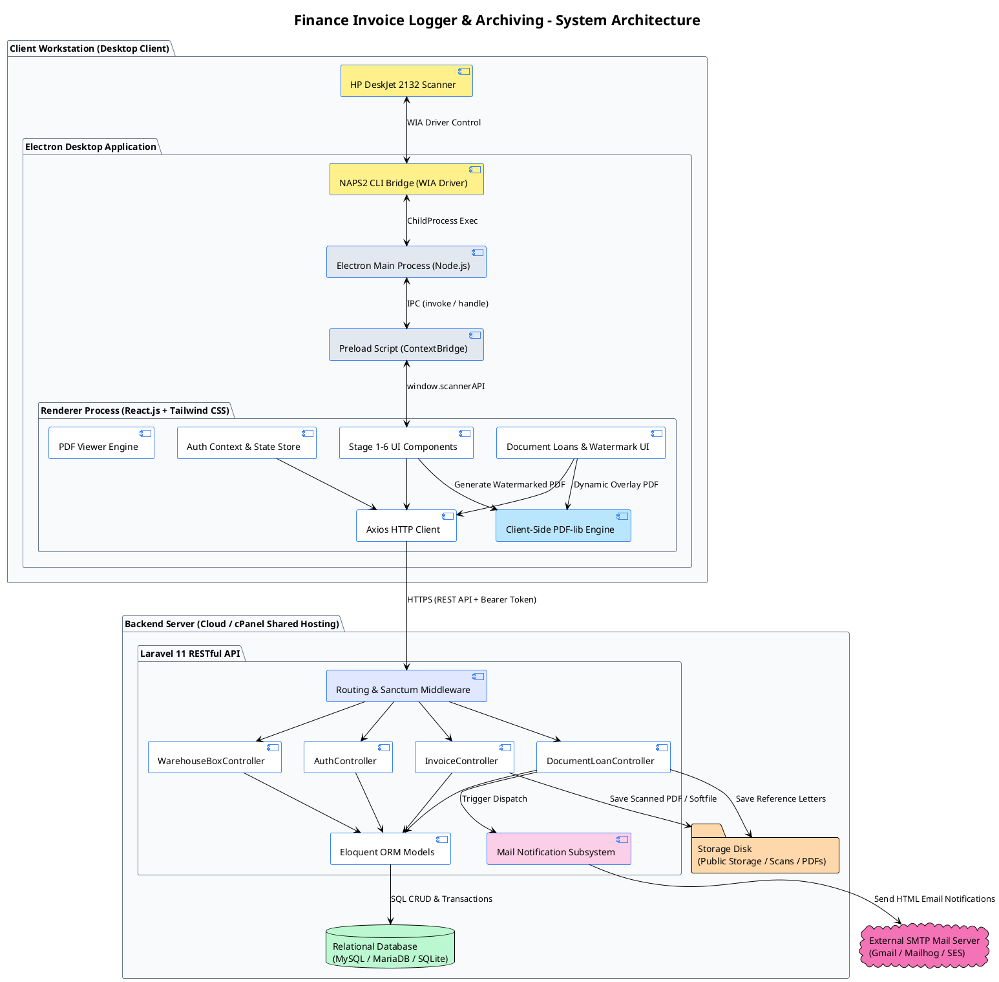

---

## 3. Diagram Use Case

Menjelaskan relasi aktor (Admin, Logger, Supervisor/FP, Warehouse, dan Peminjam Eksternal) terhadap fitur dan fungsi sistem.

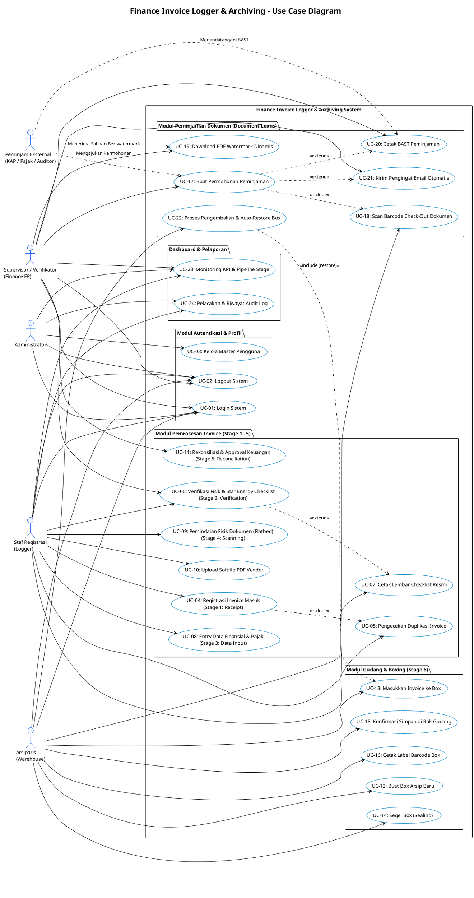

---

## 4. Diagram Sequence

### 4.1 Sequence Diagram: Autentikasi (Login & Logout)

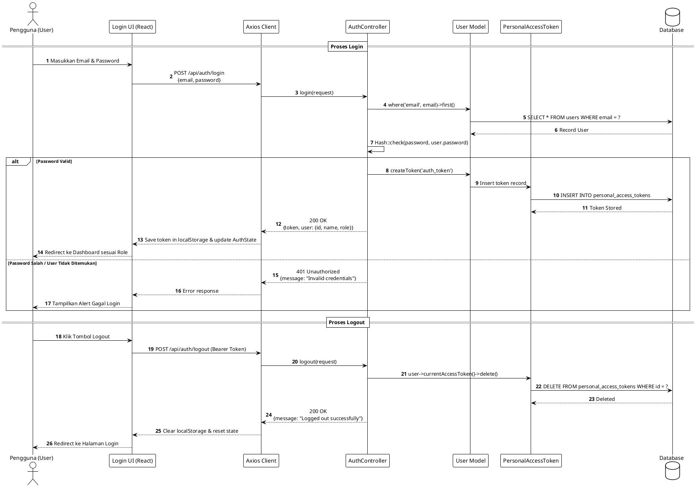

---

### 4.2 Sequence Diagram: Tahap 1 (Penerimaan & Registrasi Invoice)

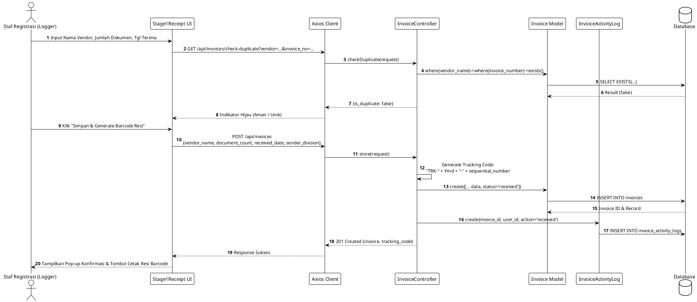

---

### 4.3 Sequence Diagram: Tahap 2 (Verifikasi Fisik & Checklist Star Energy)

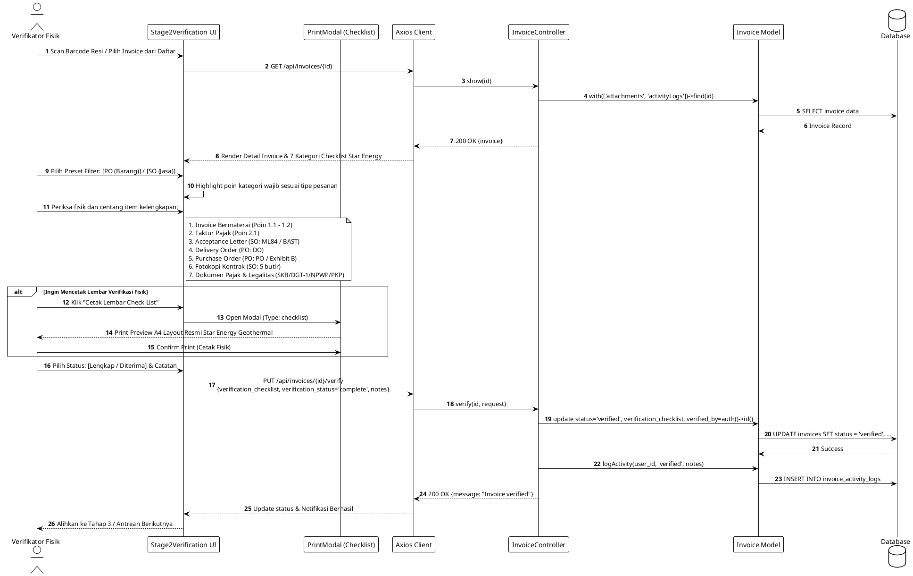

---

### 4.4 Sequence Diagram: Tahap 3 (Entry Data Finansial & Pajak)

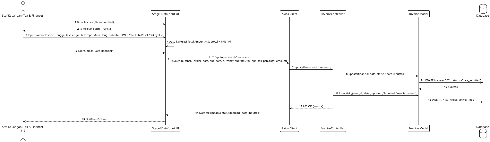

---

### 4.5 Sequence Diagram: Tahap 4 (Digitalisasi Scanner & Upload Attachment)

```plantuml
@startuml Sequence_Stage4_Scanning
!theme plain
autonumber
skinparam shadowing false
skinparam sequenceMessageAlign center

actor "Operator Scanner" as Operator
participant "Stage4Scanning UI" as UI
participant "Preload (scannerAPI)" as Preload
participant "Electron Main Process" as ElectronMain
participant "NAPS2.Console CLI" as NAPS2
participant "HP DeskJet 2132" as Scanner
participant "Axios Client" as Axios
participant "InvoiceController" as InvCtrl
participant "Storage Disk" as Storage
database "Database" as DB

== Pemindaian Fisik (Multi-Page Flatbed Append Pattern) ==
Operator -> UI : Letakkan Halaman 1 pada Kaca Scanner & Klik "Pindai Halaman"
UI -> Preload : window.scannerAPI.scanPage({pageNumber: 1})
Preload -> ElectronMain : ipcRenderer.invoke('scan-page', 1)
ElectronMain -> NAPS2 : Exec CLI: NAPS2.Console.exe -o "%TEMP%/page_1.pdf" --driver wia --source glass --dpi 200
NAPS2 -> Scanner : Trigger Hardware Scan
Scanner --> NAPS2 : Raw Image Data
NAPS2 --> ElectronMain : page_1.pdf Generated
ElectronMain --> Preload : Success {path: ".../page_1.pdf"}
Preload --> UI : Preview Thumbnail Page 1

Operator -> UI : Ganti Kertas Lembar 2 & Klik "Pindai Halaman Berikutnya"
UI -> Preload -> ElectronMain -> NAPS2 -> Scanner : Pindai page_2.pdf
Scanner --> NAPS2 --> ElectronMain --> UI : Preview Thumbnail Page 2

Operator -> UI : Klik "Gabungkan & Unggah PDF Final"
UI -> Preload : window.scannerAPI.mergeAndExportPDF([page_1, page_2])
ElectronMain -> NAPS2 : Exec Merge command -> invoice_scanned_final.pdf
ElectronMain --> UI : Return Merged Buffer / Path

UI -> Axios : POST /api/invoices/upload-scan (FormData: file, invoice_id, source='scanner_flatbed')
Axios -> InvCtrl : uploadScan(request)
InvCtrl -> Storage : Storage::disk('public')->putFileAs('invoices/scans', file, filename)
Storage --> InvCtrl : File Path Stored
InvCtrl -> DB : INSERT INTO invoice_attachments (invoice_id, file_path, file_size_kb, page_count, source)
InvCtrl -> DB : UPDATE invoices SET status='scanned'
InvCtrl --> Axios : 200 OK {attachment, status: 'scanned'}
Axios --> UI : Render Dokumen di PDF Viewer
UI --> Operator : Tanda Centang Hijau: "Dokumen Berhasil Didigitalisasi"

@enduml
```

---

### 4.6 Sequence Diagram: Tahap 5 (Rekonsiliasi & Finalisasi Supervisor)

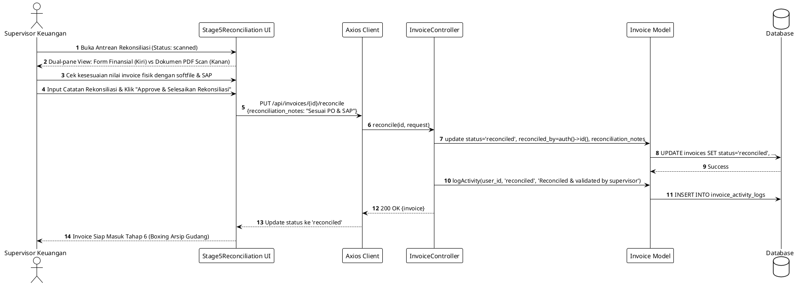

---

### 4.7 Sequence Diagram: Tahap 6 (Pengemasan Box & Pengarsipan Gudang)

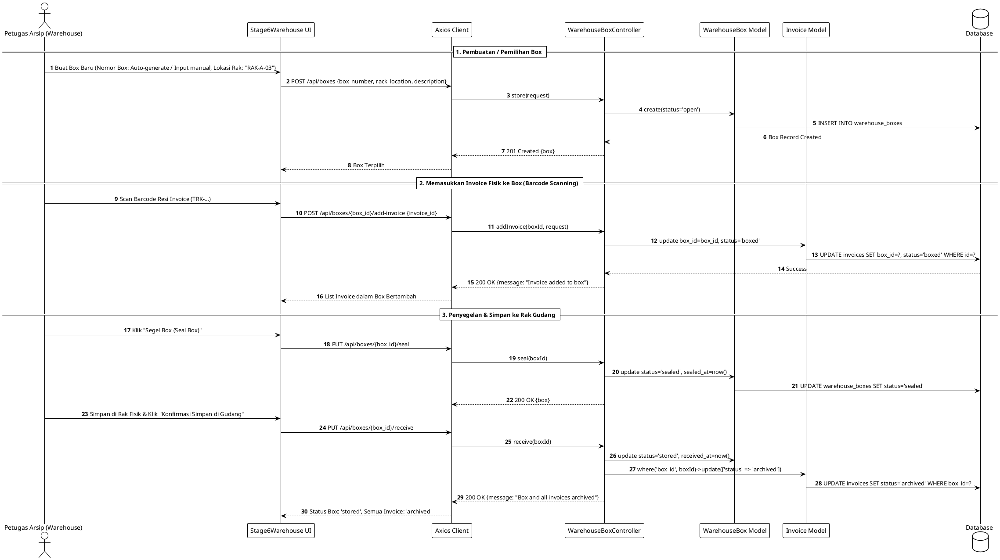

---

### 4.8 Sequence Diagram: Peminjaman Dokumen & Dynamic Watermarking PDF

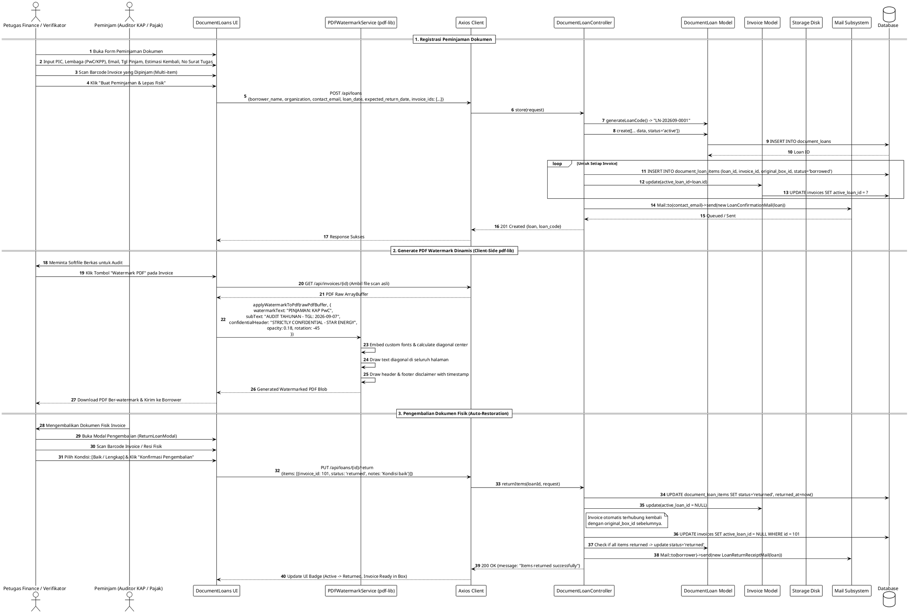

---

### 4.9 Sequence Diagram: Otomasi Notifikasi Email & Pengingat Jatuh Tempo

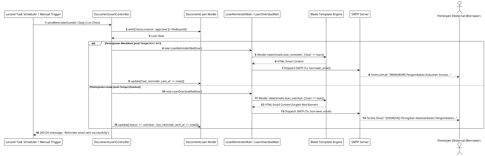

---

## 5. Diagram Kelas (Class Diagram)

Menjelaskan struktur berorientasi objek pada backend Laravel, termasuk Controller, Model Eloquent, Mailables, dan keterhubungannya.

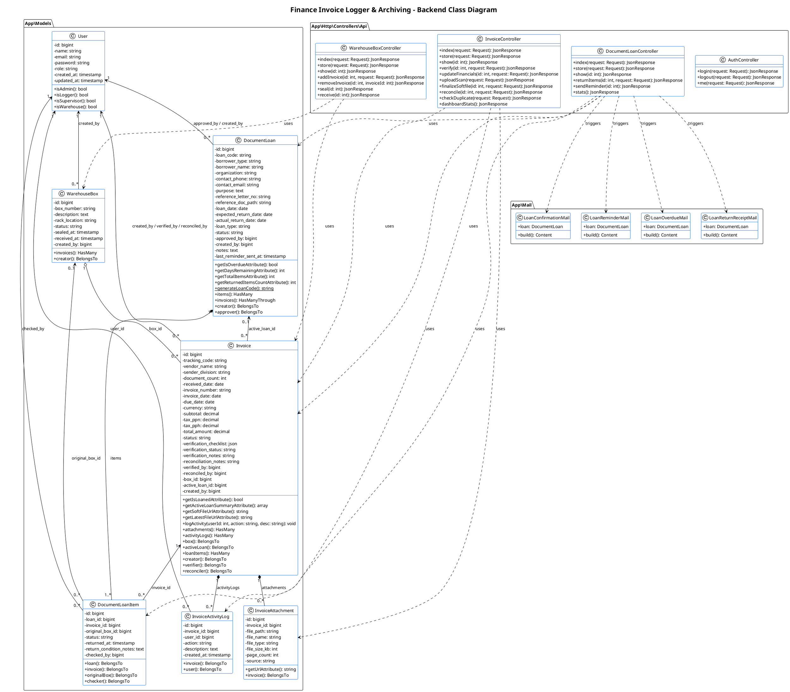

---

## 6. Diagram Relasi Entitas / Database (ERD)

Menampilkan skema relasi database relasional, tipe data, *primary key*, *foreign key*, dan indeks tabel.

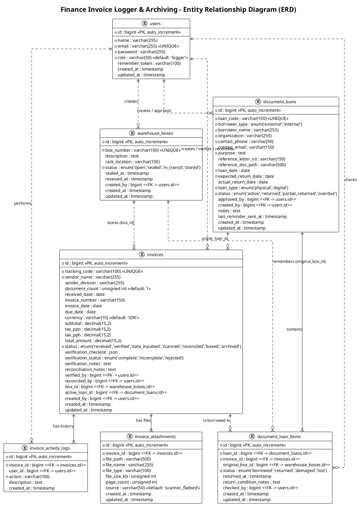

---

## 7. Diagram State Machine

### 7.1 State Machine: Invoice Lifecycle (6-Stage Pipeline)

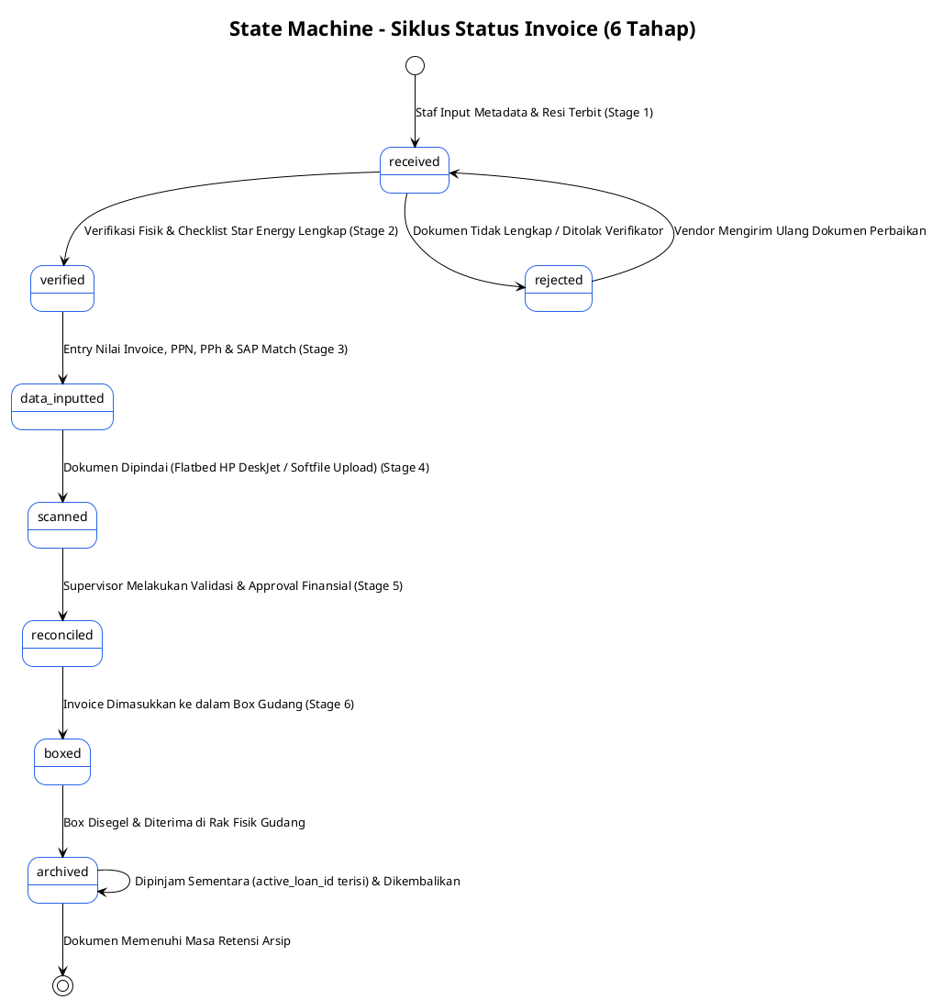

---

### 7.2 State Machine: Document Loan Lifecycle

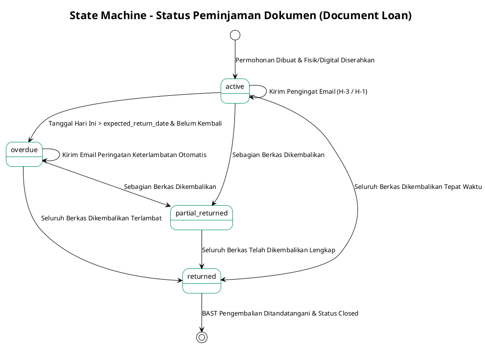

---

### 7.3 State Machine: Warehouse Box Lifecycle

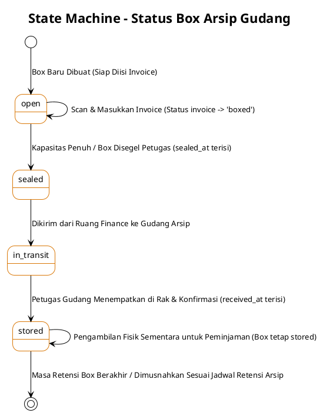

---

## 8. Diagram Aktivitas (Activity Diagrams)

### 8.1 Activity Diagram: Alur Pemrosesan Dokumen End-to-End

```plantuml
@startuml Activity_EndToEnd
!theme plain
skinparam shadowing false
skinparam activityBackgroundColor #FFFFFF
skinparam activityBorderColor #2563EB

title Activity Diagram - Alur End-to-End Pemrosesan Dokumen

start
:Vendor Mengirimkan Berkas Invoice Fisik;
:Staf Registrasi (Logger) Membuka Sistem;
:Input Metadata Awal (Vendor, Jumlah Lembar, Tgl Terima);
:Sistem Melakukan Pengecekan Duplikasi;

if (Duplikat Ditemukan?) then (Ya)
    :Tampilkan Peringatan & Hentikan Proses;
    stop
else (Tidak)
    :Generate Resi Barcode Pelacakan (TRK-...);
    :Cetak Label Resi & Tempelkan pada Berkas Fisik;
endif

:Verifikator Membuka Stage 2;
:Pilih Preset (Purchase Order / Service Order);
:Pemeriksaan Fisik 7 Kategori Checklist Star Energy;

if (Dokumen Lengkap & Sah?) then (Tidak)
    :Tandai "Incomplete / Rejected" & Tulis Catatan;
    :Kirimkan Berkas Balik ke Vendor / Bagian Terkait;
    stop
else (Lengkap)
    :Tandai "Complete" & Simpan Hasil Checklist;
    opt Cetak Lembar Checklist Resmi
        :Cetak Form Verifikasi Standar Star Energy A4;
    end
endif

:Staf Pajak/Keuangan Input Nilai Finansial (Stage 3);
:Entry No Invoice, Subtotal, PPN, PPh, & Jatuh Tempo;
:Operator Melakukan Pemindaian Scanner Flatbed (Stage 4);
:Gabungkan Seluruh Lembar Menjadi File PDF Tunggal;
:Upload PDF Hasil Scan ke Sistem;

:Supervisor Keuangan Membuka Stage 5 (Rekonsiliasi);
:Bandingkan Tampilan Dual-Pane (Form Fisik vs PDF Scan);

if (Data Cocok & Disetujui?) then (Ya)
    :Supervisor Klik "Approve & Selesaikan Rekonsiliasi";
else (Revisi Diperlukan)
    :Kembalikan ke Tahap Input untuk Koreksi;
    stop
endif

:Petugas Gudang Membuka Stage 6 (Boxing);
:Scan Barcode Resi untuk Memasukkan ke Box Arsip (BOX-...);
:Segel Box & Simpan pada Nomor Rak Gudang yang Ditentukan;
:Konfirmasi Penerimaan di Sistem (Status -> 'archived');

stop
@enduml
```

---

### 8.2 Activity Diagram: Alur Peminjaman, Watermarking, dan Pengembalian

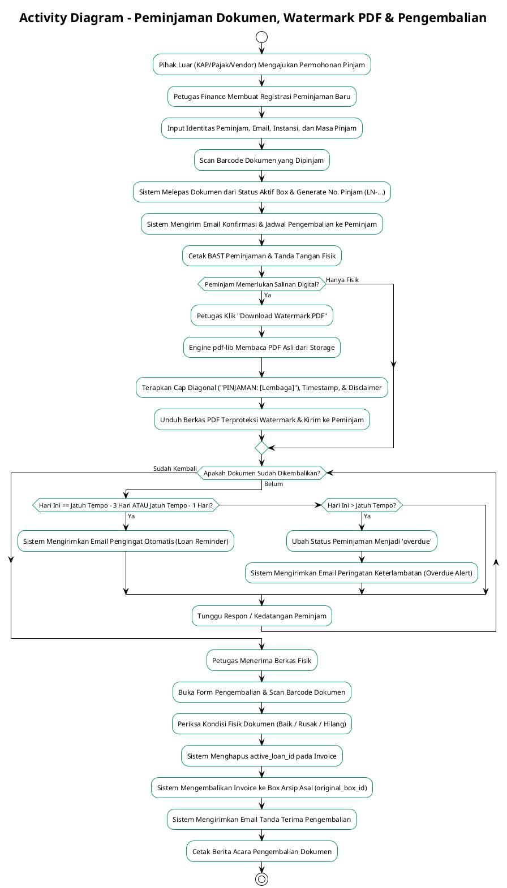

---

## 9. Diagram Deployment & Infrastruktur

Menjelaskan topologi perangkat keras dan jaringan pada implementasi *Finance-Logger*.

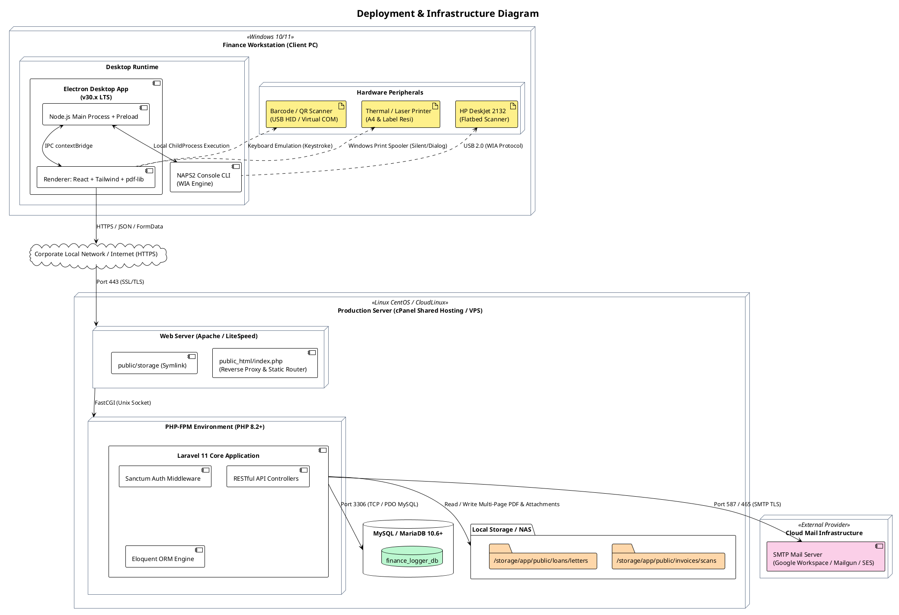

---

## 10. Panduan Penggunaan & Rendering Diagram PlantUML

Diagram di atas dapat langsung dilihat atau diekspor dengan metode:

1. **Visual Studio Code:**
   - Install ekstensi `PlantUML` (`jebbs.plantuml`).
   - Tekan `Alt + D` pada file ini untuk melihat preview interaktif diagram secara langsung.
2. **PlantUML Online Server:**
   - Copy blok kode antara `@startuml` dan `@enduml` ke [PlantUML Web Server](http://www.plantuml.com/plantuml/uml/).
3. **Automated CI/CD Pipeline:**
   - Gunakan CLI `plantuml.jar` atau Docker image `plantuml/plantuml-server` untuk menghasilkan format `.png`, `.svg`, atau `.pdf` dalam dokumentasi teknis kantor.

---
*Dokumentasi ini dibuat secara resmi untuk sistem Finance Invoice Logger & Archiving System (Finance-Logger).*
